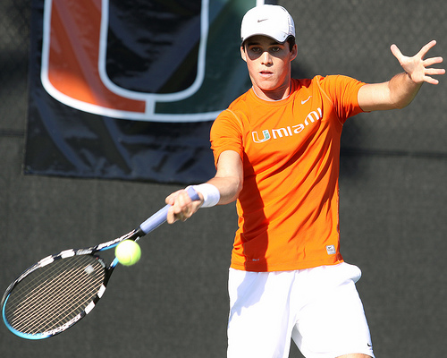

# Image captioning using Detection Transformer (DeTR)

We modify the **[DeTR](https://github.com/facebookresearch/detr)** architecture to perform image captioning. The DeTR architecture is implemented from scratch in **Pytorch** and modified to perform image captioning task

## Installing the environment

```
conda env create -f caption-pytorch.yaml
conda activate image-caption-pytorch
```

## Train on Flickr30k dataset

We train the captioning model on Flickr30k dataset

```
python train.py --gpu 6 --save_path saved_models/detr_img_caption_lr000001_e300_v3.pth --lr 0.00001 --epochs 300 --return_logs True
```

The parameters can be adjusted via command line arguments

## Test on Flickr8/30k dataset

We provide implementation for inferencing on Flickr8/30k dataset both. The below scripts provides **BLEU** score for predicted and ground truth captions. 

**Format**

```
python test.py --gpu <gpu_id> --model_path <detr_model_path> --image_path <Flickr8/30k_image_path> --captions_path <Flickr8/30k_captions_path> --vocab_path vocab/vocab.pkl --dataset <Flickr8k/Flickr30k> --return_logs <True/False>
```

**Example**

```
python test.py --gpu 6 --model_path saved_models/detr_img_caption_lr000001_e300_v3.pth --image_path /DATA/dataset/Flickr8k/Images --captions_path /DATA/dataset/Flickr8k/captions.txt --vocab_path vocab/vocab.pkl --dataset Flickr8k --return_logs True
```

## Caption a sample Image

**Format**

```
python test_sample.py --vocab_path vocab/vocab.pkl --model_path <detr_model_path> --gpu <gpu_id> --image_path <sample_image_path> 
```

**Example** 

```
python test_sample.py --vocab_path vocab/vocab.pkl --model_path saved_models/detr_img_caption_lr00001_e300_v2.pth --gpu 6 --image_path "/DATA/dataset/Flickr8k/Images/1895768965_43cd9d164f.jpg"
```

## Captioned Samples



**predicted:** <SOS> a man in an orange shirt hitting a tennis ball with a racket <EOS>